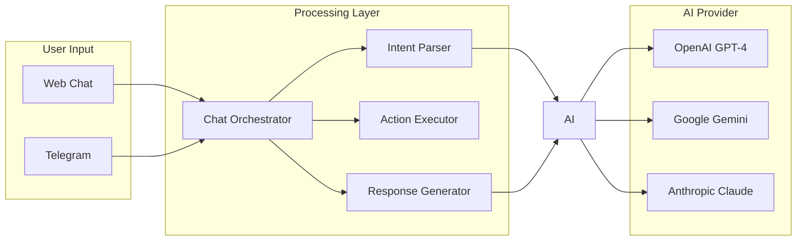
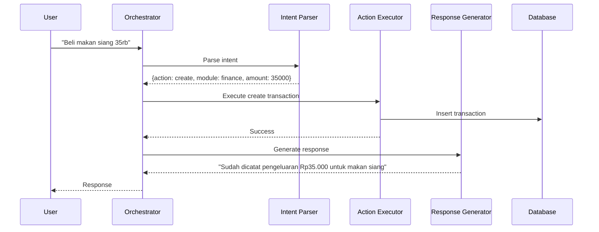
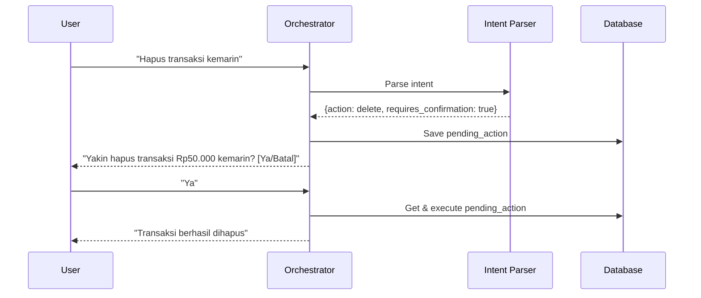

# ASPRI AI Integration Guide

## Overview

ASPRI menggunakan AI untuk memproses perintah natural language dan memberikan respons yang personal. Dokumen ini menjelaskan strategi integrasi AI.

## Architecture



## AI Provider Abstraction

### Interface Definition

```php
<?php

namespace App\Services\AI;

interface AiProviderInterface
{
    /**
     * Generate chat response
     */
    public function chat(array $messages, array $options = []): string;
    
    /**
     * Parse user intent from message
     */
    public function parseIntent(string $message, array $context = []): Intent;
    
    /**
     * Generate embedding for text
     */
    public function embed(string $text): array;
}
```

### Intent Data Structure

```php
<?php

namespace App\Services\AI;

class Intent
{
    public function __construct(
        public string $action,        // create, update, delete, query, chat
        public string $module,        // finance, schedule, note, general
        public array $entities = [],  // extracted entities
        public float $confidence = 0, // 0.0 - 1.0
        public ?string $raw = null,   // original message
    ) {}
}
```

## Intent Recognition

### Supported Intents

| Intent | Module | Example | Entities |
|--------|--------|---------|----------|
| `finance.create` | Finance | "Beli kopi 25rb" | amount, category, note |
| `finance.query` | Finance | "Berapa pengeluaran minggu ini?" | period |
| `schedule.create` | Schedule | "Ingatkan meeting jam 3 sore" | title, time |
| `schedule.query` | Schedule | "Jadwal besok apa?" | date |
| `note.create` | Note | "Catat: meeting notes..." | content |
| `note.query` | Note | "Cari catatan tentang project" | keyword |
| `general.chat` | General | "Halo, apa kabar?" | - |

### Intent Parsing Prompt

```
You are ASPRI, a personal assistant AI. Parse the user's message and extract the intent.

User message: "{message}"

Context:
- Current time: {current_time}
- User timezone: {timezone}
- User name: {call_preference}

Respond in JSON format:
{
  "action": "create|update|delete|query|chat",
  "module": "finance|schedule|note|general",
  "entities": {
    "amount": number (for finance),
    "category": string (for finance),
    "title": string (for events/notes),
    "datetime": ISO string (for events),
    "content": string (for notes),
    "period": "today|week|month" (for queries)
  },
  "confidence": 0.0-1.0,
  "requires_confirmation": boolean,
  "confirmation_message": string (if requires confirmation)
}
```

## Response Generation

### Persona-aware Response

```
You are {aspri_name}, a personal assistant with the following personality:
{aspri_persona}

When responding:
- Call the user "{call_preference}"
- Use language: {locale}
- Be helpful but concise
- If action was successful, confirm briefly
- If action failed, explain what went wrong

User's message: "{message}"
Action result: {action_result}

Generate a natural response.
```

## Provider Implementations

### OpenAI Provider

```php
<?php

namespace App\Services\AI\Providers;

class OpenAiProvider implements AiProviderInterface
{
    public function __construct(
        private string $apiKey,
        private string $model = 'gpt-4-turbo-preview',
    ) {}
    
    public function chat(array $messages, array $options = []): string
    {
        $response = Http::withToken($this->apiKey)
            ->post('https://api.openai.com/v1/chat/completions', [
                'model' => $this->model,
                'messages' => $messages,
                'temperature' => $options['temperature'] ?? 0.7,
                'max_tokens' => $options['max_tokens'] ?? 1000,
            ]);
            
        return $response->json('choices.0.message.content');
    }
}
```

### Google Gemini Provider

```php
<?php

namespace App\Services\AI\Providers;

class GeminiProvider implements AiProviderInterface
{
    public function __construct(
        private string $apiKey,
        private string $model = 'gemini-pro',
    ) {}
    
    public function chat(array $messages, array $options = []): string
    {
        $response = Http::withToken($this->apiKey)
            ->post("https://generativelanguage.googleapis.com/v1/models/{$this->model}:generateContent", [
                'contents' => $this->formatMessages($messages),
                'generationConfig' => [
                    'temperature' => $options['temperature'] ?? 0.7,
                    'maxOutputTokens' => $options['max_tokens'] ?? 1000,
                ],
            ]);
            
        return $response->json('candidates.0.content.parts.0.text');
    }
}
```

## Configuration

### Environment Variables

```env
# AI Provider Configuration
AI_PROVIDER=openai  # openai, gemini, anthropic

# OpenAI
OPENAI_API_KEY=sk-...
OPENAI_MODEL=gpt-4-turbo-preview

# Google Gemini
GEMINI_API_KEY=...
GEMINI_MODEL=gemini-pro

# Anthropic
ANTHROPIC_API_KEY=sk-ant-...
ANTHROPIC_MODEL=claude-3-sonnet
```

### Config File

```php
// config/ai.php
return [
    'provider' => env('AI_PROVIDER', 'openai'),
    
    'providers' => [
        'openai' => [
            'api_key' => env('OPENAI_API_KEY'),
            'model' => env('OPENAI_MODEL', 'gpt-4-turbo-preview'),
        ],
        'gemini' => [
            'api_key' => env('GEMINI_API_KEY'),
            'model' => env('GEMINI_MODEL', 'gemini-pro'),
        ],
        'anthropic' => [
            'api_key' => env('ANTHROPIC_API_KEY'),
            'model' => env('ANTHROPIC_MODEL', 'claude-3-sonnet'),
        ],
    ],
    
    'defaults' => [
        'temperature' => 0.7,
        'max_tokens' => 1000,
    ],
];
```

## Chat Flow

### Normal Chat Flow



### Confirmation Flow (Safe Mutations)



## Error Handling

```php
try {
    $intent = $this->aiProvider->parseIntent($message);
    $result = $this->executeAction($intent);
    $response = $this->generateResponse($result);
} catch (AiProviderException $e) {
    Log::error('AI Provider error', ['error' => $e->getMessage()]);
    $response = "Maaf, saya sedang mengalami gangguan. Coba lagi nanti ya.";
} catch (ActionExecutionException $e) {
    $response = "Maaf, saya tidak bisa melakukan itu: " . $e->getMessage();
}
```

## Rate Limiting

- Max 60 requests per minute per user
- Implement exponential backoff for provider errors
- Cache intent results for similar messages
