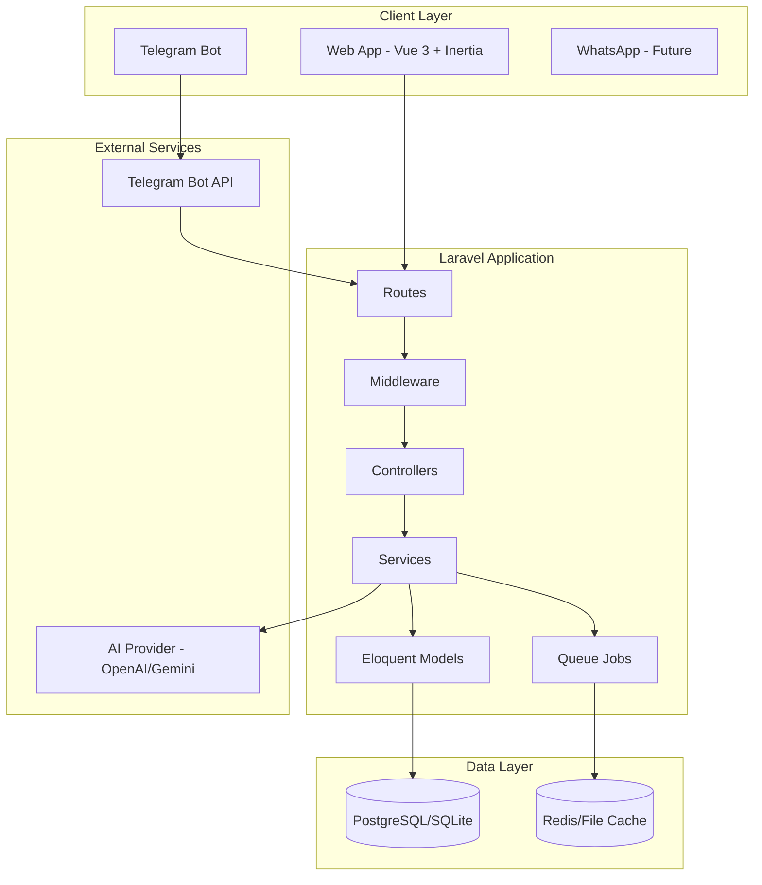
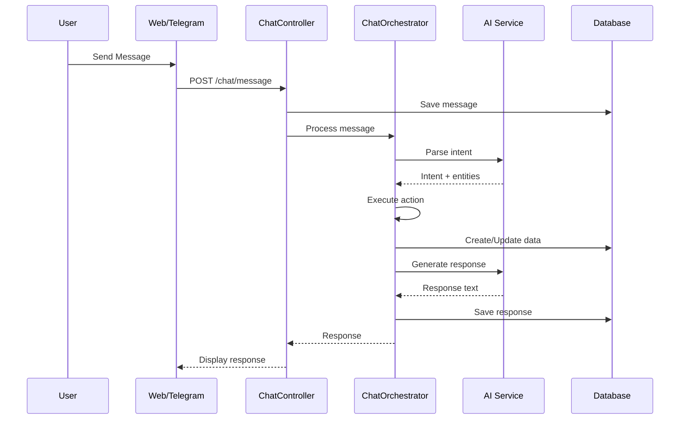
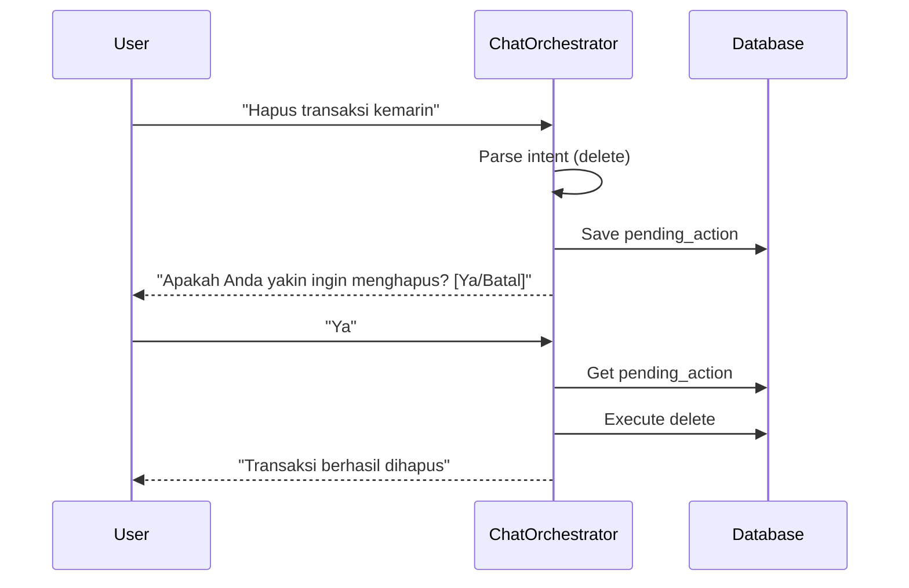

# ASPRI Architecture - Laravel 12 + Vue 3

## Overview

ASPRI (Asisten Pribadi Berbasis AI) adalah aplikasi asisten pribadi cerdas untuk pengelolaan jadwal dan keuangan harian.

## Tech Stack

| Component | Technology | Version |
|-----------|------------|---------|
| Backend Framework | Laravel | 12 |
| Frontend Framework | Vue | 3.5 |
| Frontend SPA | Inertia.js | 2.x |
| Styling | Tailwind CSS | 4.x |
| Database | PostgreSQL | 16+ |
| Authentication | Laravel Built-in | Latest |
| AI Integration | Gemini/OpenAI/Claude | Latest |
| Bot Integration | Telegram Bot API | - |
| Type Safety | TypeScript | 5.x |
| Route Generation | Wayfinder | 0.x |

## High-Level Architecture



## Directory Structure

```
aspri/
├── app/
│   ├── Http/
│   │   ├── Controllers/
│   │   │   ├── DashboardController.php
│   │   │   ├── ChatController.php
│   │   │   ├── NoteController.php
│   │   │   ├── ScheduleController.php
│   │   │   ├── FinanceController.php
│   │   │   └── Api/
│   │   │       └── TelegramWebhookController.php
│   │   ├── Middleware/
│   │   └── Requests/
│   ├── Models/
│   │   ├── User.php
│   │   ├── ChatThread.php
│   │   ├── ChatMessage.php
│   │   ├── Note.php
│   │   ├── NoteBlock.php
│   │   ├── Calendar.php
│   │   ├── Event.php
│   │   ├── FinanceAccount.php
│   │   ├── FinanceCategory.php
│   │   └── FinanceTransaction.php
│   ├── Services/
│   │   ├── AI/
│   │   │   ├── AssistantService.php
│   │   │   └── IntentParserService.php
│   │   ├── Chat/
│   │   │   └── ChatOrchestrator.php
│   │   └── Telegram/
│   │       └── TelegramBotService.php
│   └── Jobs/
│       ├── ProcessChatMessage.php
│       └── SendReminder.php
├── resources/
│   ├── js/
│   │   ├── pages/
│   │   │   ├── Dashboard.vue
│   │   │   ├── Chat/
│   │   │   ├── Notes/
│   │   │   ├── Schedule/
│   │   │   └── Finance/
│   │   ├── components/
│   │   └── composables/
│   └── css/
├── database/
│   ├── migrations/
│   └── seeders/
├── routes/
│   ├── web.php
│   └── api.php
└── docs/
```

## Module Overview

### 1. Dashboard
- Ringkasan metrik jadwal dan keuangan
- Widget aktivitas terbaru
- Quick actions (Add Expense, New Event)

### 2. Chat
- Percakapan dengan asisten AI
- Integrasi Telegram
- Chat-first interaction untuk semua modul
- Persona per user (call_preference, aspri_persona)

### 3. Admin (Super Admin Only)
- User management
- AI Provider settings (Gemini default, OpenAI, Claude)
- System configuration
- Usage analytics
- Telegram bot configuration

### 3. Notes
- Penyimpanan note dengan block-based content
- Tag dan kategorisasi
- Backlinks antar note
- Version history

### 4. Schedule
- Kalender internal
- Event dan reminder
- Recurring events (RRULE)
- Notifikasi via app dan Telegram

### 5. Finance
- Pencatatan transaksi (income/expense/transfer)
- Kategori dan akun
- Budgeting
- Laporan dan visualisasi

## Data Flow

### Chat Message Processing



### Safe Mutations (Confirmation Flow)



## Authentication

Laravel Breeze akan digunakan untuk autentikasi dengan fitur:
- Email/password registration
- Login/logout
- Password reset
- Profile management

Untuk Telegram linking:
1. User klik "Link Telegram" di web
2. Backend generate one-time code (TTL 5 menit)
3. User kirim `/link <CODE>` ke bot
4. Backend validate dan mapping chat_id ke user_id

## AI Integration

Menggunakan abstraksi service untuk provider-agnostic:

```php
interface AiProviderInterface
{
    public function chat(array $messages): string;
    public function parseIntent(string $message): Intent;
}
```

Implementasi tersedia untuk:
- OpenAI (GPT-4)
- Google Gemini
- Anthropic Claude

Konfigurasi via `.env`:
```
AI_PROVIDER=openai
OPENAI_API_KEY=sk-...
```

## Security Considerations

- Data isolation per user (semua query filter by user_id)
- CSRF protection (Inertia handles automatically)
- Rate limiting pada API endpoints
- Input validation dengan Form Requests
- XSS prevention (Vue auto-escapes)
