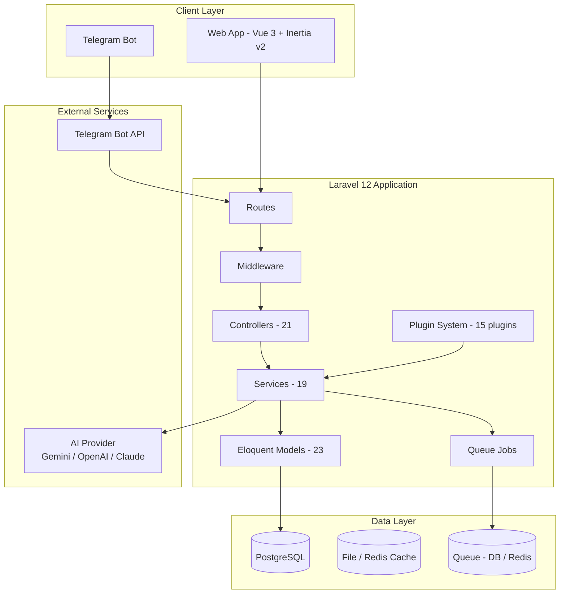
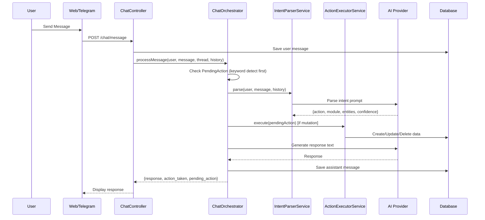
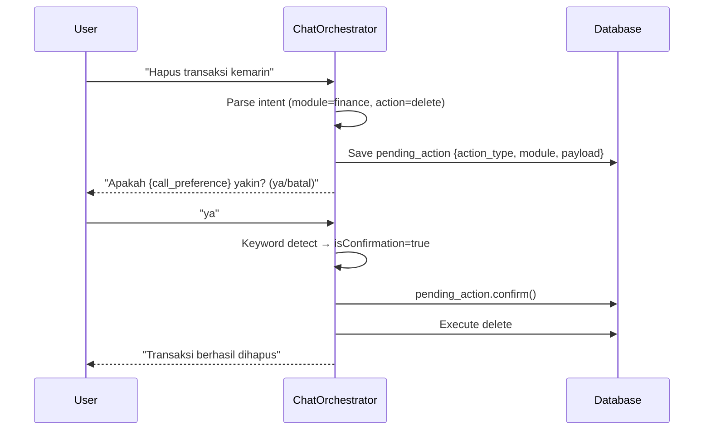
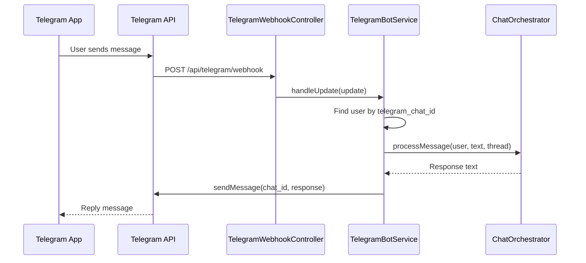

# ASPRI Architecture - Laravel 12 + Vue 3

> **Last Updated**: May 2026  
> Dokumen ini mendeskripsikan arsitektur aktual yang sudah diimplementasi.

## Overview

ASPRI (Asisten Pribadi Berbasis AI) adalah aplikasi asisten pribadi cerdas untuk pengelolaan jadwal dan keuangan harian, dilengkapi sistem plugin yang extensible, integrasi Telegram, dan dukungan multi-provider AI (Gemini, OpenAI, Claude).

## Tech Stack

| Component | Technology | Version |
|-----------|------------|---------|
| Backend Framework | Laravel | 12 |
| Frontend Framework | Vue | 3.5 |
| Frontend SPA | Inertia.js | 2.x |
| Styling | Tailwind CSS | 4.x |
| Database | PostgreSQL | 16+ |
| Authentication | Laravel Fortify | 1.x |
| AI Integration | Gemini / OpenAI / Claude | multi-provider |
| Bot Integration | Telegram Bot API (irazasyed/telegram-bot-sdk) | 3.x |
| Type Safety | TypeScript | 5.x |
| Route Generation | Laravel Wayfinder | 0.x |
| UI Components | Reka UI | 2.x |
| Subscription | Custom (built-in) | - |

## High-Level Architecture


```mermaid
graph TB
  subgraph "Client Layer"
    WEB[Web App - Vue 3 + Inertia v2]
    TG[Telegram Bot]
  end

  subgraph "Laravel 12 Application"
    ROUTE[Routes]
    MW[Middleware]
    CTRL[Controllers - 21]
    SVC[Services - 19]
    MODEL[Eloquent Models - 23]
    JOB[Queue Jobs]
    PLUGIN[Plugin System - 15 plugins]
  end

  subgraph "External Services"
    AI[AI Provider<br/>Gemini / OpenAI / Claude]
    TGAPI[Telegram Bot API]
  end

  subgraph "Data Layer"
    DB[(PostgreSQL)]
    CACHE[(File / Redis Cache)]
    QUEUE[(Queue - DB / Redis)]
  end

  WEB --> ROUTE
  TG --> TGAPI --> ROUTE
  ROUTE --> MW --> CTRL
  CTRL --> SVC
  SVC --> MODEL --> DB
  SVC --> AI
  SVC --> JOB --> QUEUE
  PLUGIN --> SVC
```

## Directory Structure (Actual)

```
aspri/
├── app/
│   ├── Actions/Fortify/           # Fortify actions (CreateNewUser, ResetPassword)
│   ├── Concerns/                  # Shared validation traits
│   ├── Console/Commands/          # 6 artisan commands
│   ├── Http/
│   │   ├── Controllers/           # 21 controllers (web + admin + settings + api)
│   │   ├── Middleware/            # 5 middleware
│   │   └── Requests/              # 13 Form Request classes
│   ├── Models/                    # 23 Eloquent models
│   ├── Notifications/             # WelcomeNotification
│   ├── Plugins/                   # 15 built-in plugins
│   ├── Policies/                  # 2 policies (ChatThread, Note)
│   ├── Providers/                 # AppServiceProvider, FortifyServiceProvider
│   └── Services/
│       ├── Ai/                    # AI abstraction + orchestration (8 files)
│       ├── Admin/                 # Admin settings + monitoring (2 files)
│       ├── Plugin/                # Plugin lifecycle management (5 files)
│       ├── Subscription/          # Subscription + promo codes (2 files)
│       └── Telegram/              # Telegram bot + notifications (2 files)
├── resources/
│   └── js/
│       ├── pages/                 # 30+ Inertia page components
│       ├── components/            # 50+ Vue components
│       │   └── ui/                # 30+ Reka UI base components
│       ├── layouts/               # AppLayout, AuthLayout, AdminLayout
│       ├── composables/           # Vue composables
│       ├── types/                 # TypeScript type definitions
│       └── i18n/                  # en + id translations
├── database/
│   ├── migrations/                # 33 migrations
│   ├── factories/                 # 14 model factories
│   └── seeders/
├── routes/
│   ├── web.php                    # Main web routes
│   ├── api.php                    # API routes (Telegram webhook)
│   ├── settings.php               # Settings sub-routes
│   └── console.php                # Console command routes
└── tests/
    ├── Feature/                   # 26+ feature tests
    │   ├── Auth/                  # Auth flow tests
    │   ├── Integration/           # Full workflow integration tests
    │   └── Settings/              # Settings tests
    └── Unit/                      # Unit tests (PluginCompliance)
```

## Application Modules

### 1. Dashboard
- Ringkasan keuangan bulanan (income, expense, balance)
- Jadwal hari ini
- Quick actions (tambah transaksi, event baru)
- Chart pengeluaran mingguan
- Status subscription + Telegram link card

### 2. Admin Panel (Super Admin)
- User management (CRUD, activate/deactivate, promote)
- AI provider configuration (Gemini default, OpenAI, Claude, + API keys & model)
- System settings (app name, timezone, locale, maintenance)
- Telegram bot configuration (token, webhook)
- Activity logs & audit trail
- Subscription & payment management
- Promo code management
- Queue monitor

### 3. Chat Module
- Web-based chat interface dengan thread management
- Telegram bot integration (webhook-based)
- Intent parsing via AI provider
- Confirmation flow untuk mutation actions (create/update/delete)
- Natural language command execution
- Context-aware responses (conversation history dalam 1 thread)
- Plugin-aware responses

### 4. Notes Module
- CRUD notes dengan rich text content
- Tags (JSON array per note)
- Pin notes
- Soft delete & color-coding

### 5. Schedule Module
- Calendar view (monthly)
- Event CRUD dengan lokasi dan deskripsi
- All-day support
- Recurring events (RRULE string)
- Completion tracking (is_completed)

### 6. Finance Module
- Transaction recording (income/expense)
- Multi-account support (cash, bank, e-wallet)
- Category management per tx_type
- Monthly summary & charts
- Attachment support (PaymentProof)

### 7. Plugin System
- 15 built-in plugins (BirthdayReminder, BookTracker, CurrencyConverter, ExpenseAlert, HabitTracker, HealthTracker, KataMotivasi, MoodJournal, NewsHeadlines, PengingatMinumAir, PomodoroTimer, PrayerTimes, QuoteOfTheDay, RandomFacts, WeatherForecast)
- Plugin discovery & registry
- Per-user activation + configuration schema
- Scheduled plugin tasks (ProcessPluginSchedules command)
- Plugin activity logging & ratings
- Plugin-chat integration (AI-aware execution)

### 8. Subscription System
- Trial, Basic, Premium tiers
- Payment proof upload
- Promo code generation & redemption
- Chat usage metering (ChatUsageLog)

## Service Layer

### AI Services (`app/Services/Ai/`)

| Service | Responsibility |
|---------|----------------|
| `AiProviderInterface` | Contract untuk semua AI provider |
| `GeminiProvider` | Google Gemini implementation |
| `OpenAiProvider` | OpenAI GPT implementation |
| `ClaudeProvider` | Anthropic Claude implementation |
| `ChatOrchestrator` | Orkestrasi alur chat (intent → action → response) |
| `ChatService` | Build system prompt + format messages |
| `IntentParserService` | Parse user intent (action, module, entities) |
| `ActionExecutorService` | Execute parsed intents ke modul terkait |

### Admin Services (`app/Services/Admin/`)

| Service | Responsibility |
|---------|----------------|
| `SettingsService` | CRUD system settings dari DB |
| `SystemMonitoringService` | Health check, queue status, system stats |

### Plugin Services (`app/Services/Plugin/`)

| Service | Responsibility |
|---------|----------------|
| `PluginManager` | Discovery, activation, lifecycle |
| `BasePlugin` | Abstract base class untuk semua plugin |
| `PluginConfigurationService` | Per-user plugin config management |
| `PluginSchedulerService` | Execute scheduled plugin tasks |
| `Contracts/PluginInterface` | Interface contract untuk plugin |

### Telegram Services (`app/Services/Telegram/`)

| Service | Responsibility |
|---------|----------------|
| `TelegramBotService` | Handle incoming Telegram messages |
| `AdminNotificationService` | Kirim notifikasi ke admin via Telegram |

### Subscription Services (`app/Services/Subscription/`)

| Service | Responsibility |
|---------|----------------|
| `SubscriptionService` | Trial/premium management |
| `PromoCodeService` | Generate & validate promo codes |

## Data Flow

### Chat Message Processing


```mermaid
sequenceDiagram
  participant U as User
  participant W as Web/Telegram
  participant C as ChatController
  participant O as ChatOrchestrator
  participant IP as IntentParserService
  participant AE as ActionExecutorService
  participant AI as AI Provider
  participant DB as Database

  U->>W: Send Message
  W->>C: POST /chat/message
  C->>DB: Save user message
  C->>O: processMessage(user, message, thread, history)
  O->>O: Check PendingAction (keyword detect first)
  O->>IP: parse(user, message, history)
  IP->>AI: Parse intent prompt
  AI-->>IP: {action, module, entities, confidence}
  O->>AE: execute(pendingAction) [if mutation]
  AE->>DB: Create/Update/Delete data
  O->>AI: Generate response text
  AI-->>O: Response
  O->>DB: Save assistant message
  O-->>C: {response, action_taken, pending_action}
  C-->>W: Display response
```

### Confirmation Flow (Mutation Safety)


```mermaid
sequenceDiagram
  participant U as User
  participant O as ChatOrchestrator
  participant DB as Database

  U->>O: "Hapus transaksi kemarin"
  O->>O: Parse intent (module=finance, action=delete)
  O->>DB: Save pending_action {action_type, module, payload}
  O-->>U: "Apakah {call_preference} yakin? (ya/batal)"
  U->>O: "ya"
  O->>O: Keyword detect → isConfirmation=true
  O->>DB: pending_action.confirm()
  O->>DB: Execute delete
  O-->>U: "Transaksi berhasil dihapus"
```

### Telegram Integration Flow


```mermaid
sequenceDiagram
  participant TG as Telegram App
  participant TGAPI as Telegram API
  participant WH as TelegramWebhookController
  participant TBS as TelegramBotService
  participant O as ChatOrchestrator

  TG->>TGAPI: User sends message
  TGAPI->>WH: POST /api/telegram/webhook
  WH->>TBS: handleUpdate(update)
  TBS->>TBS: Find user by telegram_chat_id
  TBS->>O: processMessage(user, text, thread)
  O-->>TBS: Response text
  TBS->>TGAPI: sendMessage(chat_id, response)
  TGAPI-->>TG: Reply message
```

## Middleware Stack

| Middleware | Purpose |
|------------|---------|
| `HandleInertiaRequests` | Share shared data ke frontend via Inertia |
| `HandleAppearance` | Inject theme preference dari profile |
| `AdminMiddleware` | Guard rute admin (role: admin/super_admin) |
| `SuperAdminMiddleware` | Guard rute super admin only |
| `TrustProxies` | Handle reverse proxy headers |

## Authentication (Fortify)

- Registration wajib isi profile (call_preference, aspri_name, aspri_persona)
- Email verification
- Password reset
- Two-factor authentication (TOTP)
- Remember me / session management

## Console Commands

| Command | Purpose |
|---------|---------|
| `CheckHttpsConfigCommand` | Verify HTTPS/proxy configuration |
| `CleanupPluginLogs` | Hapus plugin logs lama |
| `ProcessPluginSchedules` | Jalankan scheduled plugin tasks |
| `PromoteUserToAdmin` | Promosikan user ke admin |
| `TelegramGenerateLinkCode` | Generate kode link Telegram |
| `TelegramSetWebhook` | Set Telegram webhook URL |

## Frontend Architecture

### Page Structure (Inertia v2)
```
resources/js/pages/
├── Dashboard.vue              # Main dashboard
├── Welcome.vue                # Landing/home page
├── ExplorePlugins.vue         # Public plugin explorer
├── auth/                      # Login, Register, ForgotPassword, etc.
├── admin/                     # Admin panel pages
│   ├── Dashboard.vue
│   ├── users/, settings/, payments/, promo-codes/, activity/, queues/
├── chat/Index.vue             # Chat interface
├── finance/                   # Finance overview + transactions/accounts/categories
├── notes/Index.vue            # Notes list
├── plugins/                   # Plugin management
├── schedule/Index.vue         # Calendar view
└── settings/                  # Profile, Password, 2FA, Telegram, Appearance
```

### State Management
- No Vuex/Pinia; state dimanage via Inertia props + local component state
- Form state via `useForm` composable (Inertia) atau `<Form>` component

### Routing
- Backend-driven routing via Laravel + Inertia
- Type-safe route generation via **Laravel Wayfinder** (`@/actions/`, `@/routes/`)
- Client-side navigation via `<Link>` component atau `router.visit()`

## Deployment

- **Docker**: Dockerfile + supervisord (queue worker + web server)
- **Queue**: Database driver (upgradeable to Redis)
- **Storage**: Local disk (upgradeable to S3)
- **Environment**: `.env` → `config/` (env() hanya di config files)
