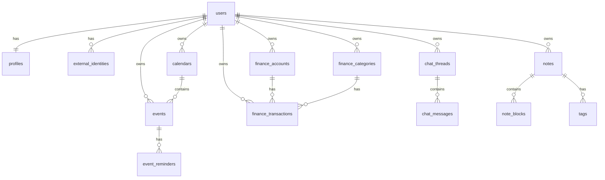

# ASPRI Database Schema

## Overview

Database schema untuk ASPRI menggunakan Laravel migrations dengan PostgreSQL.

## Entity Relationship Diagram



## Tables Detail

### Users & Profiles

#### users
Laravel default users table dengan tambahan.

```php
Schema::create('users', function (Blueprint $table) {
    $table->id();
    $table->string('name');
    $table->string('email')->unique();
    $table->timestamp('email_verified_at')->nullable();
    $table->string('password');
    $table->string('role')->default('user'); // user, admin, super_admin
    $table->boolean('is_active')->default(true);
    $table->rememberToken();
    $table->timestamps();
});
```

#### profiles
Extended user preferences dan persona settings. **All persona fields are REQUIRED during registration.**

```php
Schema::create('profiles', function (Blueprint $table) {
    $table->id();
    $table->foreignId('user_id')->constrained()->cascadeOnDelete();
    
    // Persona settings (ALL REQUIRED)
    $table->integer('birth_day'); // 1-31, REQUIRED
    $table->integer('birth_month'); // 1-12, REQUIRED
    $table->string('call_preference'); // "Kak", "Bapak", "Ibu", etc, REQUIRED
    $table->string('aspri_name'); // Custom assistant name, REQUIRED
    $table->text('aspri_persona'); // "pria", "wanita", "kucing", "anjing", or custom, REQUIRED
    
    // Preferences (with defaults)
    $table->string('timezone')->default('Asia/Jakarta');
    $table->string('locale')->default('id');
    $table->string('theme')->default('light'); // light, dark
    
    $table->timestamps();
});
```

#### external_identities
Telegram/WhatsApp account linking.

```php
Schema::create('external_identities', function (Blueprint $table) {
    $table->uuid('id')->primary();
    $table->foreignId('user_id')->constrained()->cascadeOnDelete();
    $table->string('provider'); // telegram, whatsapp
    $table->string('provider_user_id');
    $table->string('provider_chat_id')->nullable();
    $table->string('provider_username')->nullable();
    $table->boolean('is_verified')->default(true);
    $table->timestamps();
    
    $table->unique(['provider', 'provider_user_id']);
});
```

#### integration_link_codes
One-time codes untuk linking external accounts.

```php
Schema::create('integration_link_codes', function (Blueprint $table) {
    $table->uuid('id')->primary();
    $table->foreignId('user_id')->constrained()->cascadeOnDelete();
    $table->string('provider');
    $table->string('code');
    $table->timestamp('expires_at');
    $table->timestamp('used_at')->nullable();
    $table->timestamps();
    
    $table->unique(['provider', 'code']);
});
```

---

### Chat Module

#### chat_threads
Conversation threads.

```php
Schema::create('chat_threads', function (Blueprint $table) {
    $table->uuid('id')->primary();
    $table->foreignId('user_id')->constrained()->cascadeOnDelete();
    $table->string('title')->nullable();
    $table->timestamps();
});
```

#### chat_messages
Individual messages in threads.

```php
Schema::create('chat_messages', function (Blueprint $table) {
    $table->uuid('id')->primary();
    $table->uuid('thread_id');
    $table->foreignId('user_id')->constrained()->cascadeOnDelete();
    $table->string('channel'); // web, telegram, whatsapp
    $table->string('direction'); // user, assistant, system
    $table->string('external_message_id')->nullable();
    $table->text('content');
    $table->json('metadata')->nullable();
    $table->timestamps();
    
    $table->foreign('thread_id')
        ->references('id')
        ->on('chat_threads')
        ->cascadeOnDelete();
        
    $table->index(['user_id', 'created_at']);
});
```

---

### Notes Module

#### notes
Main notes table.

```php
Schema::create('notes', function (Blueprint $table) {
    $table->uuid('id')->primary();
    $table->foreignId('user_id')->constrained()->cascadeOnDelete();
    $table->string('title')->nullable();
    $table->string('status')->default('active'); // active, archived, deleted
    $table->boolean('pinned')->default(false);
    $table->timestamps();
    
    $table->index(['user_id', 'updated_at']);
});
```

#### note_blocks
Block-based content storage.

```php
Schema::create('note_blocks', function (Blueprint $table) {
    $table->uuid('id')->primary();
    $table->uuid('note_id');
    $table->foreignId('user_id')->constrained()->cascadeOnDelete();
    $table->integer('position');
    $table->string('block_type'); // text, heading, list, code, etc
    $table->json('data');
    $table->timestamps();
    
    $table->foreign('note_id')
        ->references('id')
        ->on('notes')
        ->cascadeOnDelete();
        
    $table->unique(['note_id', 'position']);
    $table->index(['note_id', 'position']);
});
```

#### tags
User-defined tags.

```php
Schema::create('tags', function (Blueprint $table) {
    $table->uuid('id')->primary();
    $table->foreignId('user_id')->constrained()->cascadeOnDelete();
    $table->string('name');
    $table->string('color')->nullable();
    $table->timestamps();
    
    $table->unique(['user_id', 'name']);
});
```

#### note_tags
Many-to-many relationship.

```php
Schema::create('note_tags', function (Blueprint $table) {
    $table->uuid('note_id');
    $table->uuid('tag_id');
    $table->foreignId('user_id')->constrained()->cascadeOnDelete();
    
    $table->primary(['note_id', 'tag_id']);
    
    $table->foreign('note_id')
        ->references('id')
        ->on('notes')
        ->cascadeOnDelete();
        
    $table->foreign('tag_id')
        ->references('id')
        ->on('tags')
        ->cascadeOnDelete();
});
```

---

### Schedule Module

#### calendars
User calendars for grouping events.

```php
Schema::create('calendars', function (Blueprint $table) {
    $table->uuid('id')->primary();
    $table->foreignId('user_id')->constrained()->cascadeOnDelete();
    $table->string('name');
    $table->string('color')->nullable();
    $table->boolean('is_default')->default(false);
    $table->timestamps();
});
```

#### events
Calendar events.

```php
Schema::create('events', function (Blueprint $table) {
    $table->uuid('id')->primary();
    $table->foreignId('user_id')->constrained()->cascadeOnDelete();
    $table->uuid('calendar_id')->nullable();
    $table->string('title');
    $table->text('description')->nullable();
    $table->timestamp('start_at');
    $table->timestamp('end_at')->nullable();
    $table->boolean('all_day')->default(false);
    $table->string('location')->nullable();
    $table->string('rrule')->nullable(); // RFC5545 RRULE
    $table->timestamps();
    
    $table->foreign('calendar_id')
        ->references('id')
        ->on('calendars')
        ->nullOnDelete();
        
    $table->index(['user_id', 'start_at']);
});
```

#### event_reminders
Reminders for events.

```php
Schema::create('event_reminders', function (Blueprint $table) {
    $table->uuid('id')->primary();
    $table->foreignId('user_id')->constrained()->cascadeOnDelete();
    $table->uuid('event_id');
    $table->timestamp('remind_at');
    $table->string('channel'); // app, telegram, whatsapp
    $table->timestamp('sent_at')->nullable();
    $table->timestamps();
    
    $table->foreign('event_id')
        ->references('id')
        ->on('events')
        ->cascadeOnDelete();
        
    $table->index(['sent_at', 'remind_at']);
});
```

---

### Finance Module

#### finance_accounts
Financial accounts (Cash, Bank, etc).

```php
Schema::create('finance_accounts', function (Blueprint $table) {
    $table->uuid('id')->primary();
    $table->foreignId('user_id')->constrained()->cascadeOnDelete();
    $table->string('name');
    $table->string('type')->default('cash'); // cash, bank, e-wallet
    $table->string('currency')->default('IDR');
    $table->decimal('initial_balance', 18, 2)->default(0);
    $table->timestamps();
    
    $table->unique(['user_id', 'name']);
});
```

#### finance_categories
Transaction categories.

```php
Schema::create('finance_categories', function (Blueprint $table) {
    $table->uuid('id')->primary();
    $table->foreignId('user_id')->constrained()->cascadeOnDelete();
    $table->string('name');
    $table->string('tx_type'); // income, expense
    $table->string('icon')->nullable();
    $table->string('color')->nullable();
    $table->timestamps();
    
    $table->unique(['user_id', 'tx_type', 'name']);
});
```

#### finance_transactions
Financial transactions.

```php
Schema::create('finance_transactions', function (Blueprint $table) {
    $table->uuid('id')->primary();
    $table->foreignId('user_id')->constrained()->cascadeOnDelete();
    $table->uuid('account_id')->nullable();
    $table->uuid('category_id')->nullable();
    $table->string('tx_type'); // income, expense, transfer
    $table->decimal('amount', 18, 2);
    $table->timestamp('occurred_at');
    $table->text('note')->nullable();
    $table->json('metadata')->nullable();
    $table->timestamps();
    
    $table->foreign('account_id')
        ->references('id')
        ->on('finance_accounts')
        ->nullOnDelete();
        
    $table->foreign('category_id')
        ->references('id')
        ->on('finance_categories')
        ->nullOnDelete();
        
    $table->index(['user_id', 'occurred_at']);
});
```

#### finance_budgets (optional)
Budget targets per category.

```php
Schema::create('finance_budgets', function (Blueprint $table) {
    $table->uuid('id')->primary();
    $table->foreignId('user_id')->constrained()->cascadeOnDelete();
    $table->uuid('category_id');
    $table->decimal('amount', 18, 2);
    $table->string('period'); // monthly, weekly
    $table->integer('period_month')->nullable();
    $table->integer('period_year')->nullable();
    $table->timestamps();
    
    $table->foreign('category_id')
        ->references('id')
        ->on('finance_categories')
        ->cascadeOnDelete();
});
```

---

## Indexes Summary

| Table | Index | Purpose |
|-------|-------|---------|
| chat_messages | user_id, created_at | Fast retrieval of user's chat history |
| notes | user_id, updated_at | Recent notes listing |
| note_blocks | note_id, position | Ordered block retrieval |
| events | user_id, start_at | Calendar range queries |
| event_reminders | sent_at, remind_at | Pending reminders processing |
| finance_transactions | user_id, occurred_at | Transaction history |
