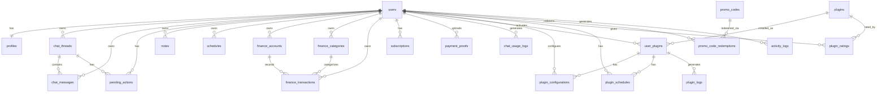

# ASPRI Database Schema

> **Last Updated**: May 2026  
> Schema ini mencerminkan migrasi yang sudah diimplementasi (33 migrations).

## Overview

Database ASPRI menggunakan PostgreSQL dengan Laravel migrations. Semua tabel utama menggunakan `user_id` untuk isolasi data per user.

## Entity Relationship Diagram


```mermaid
erDiagram
  users ||--|| profiles : has
  users ||--o{ chat_threads : owns
  users ||--o{ chat_messages : owns
  users ||--o{ pending_actions : has
  users ||--o{ notes : owns
  users ||--o{ schedules : owns
  users ||--o{ finance_accounts : owns
  users ||--o{ finance_categories : owns
  users ||--o{ finance_transactions : owns
  users ||--o{ subscriptions : has
  users ||--o{ payment_proofs : uploads
  users ||--o{ chat_usage_logs : generates
  users ||--o{ user_plugins : activates
  users ||--o{ plugin_configurations : configures
  users ||--o{ plugin_schedules : has
  users ||--o{ plugin_ratings : gives
  users ||--o{ promo_code_redemptions : redeems
  users ||--o{ activity_logs : generates

  chat_threads ||--o{ chat_messages : contains
  chat_threads ||--o{ pending_actions : has

  plugins ||--o{ user_plugins : installed_as
  plugins ||--o{ plugin_ratings : rated_by
  user_plugins ||--o{ plugin_configurations : has
  user_plugins ||--o{ plugin_schedules : has
  user_plugins ||--o{ plugin_logs : generates

  promo_codes ||--o{ promo_code_redemptions : redeemed_via
  finance_accounts ||--o{ finance_transactions : records
  finance_categories ||--o{ finance_transactions : categorizes
```

---

## Tables Detail

### Users & Authentication

#### users
Core authentication table (Laravel default + extended).

```php
Schema::create('users', function (Blueprint $table) {
    $table->id();
    $table->string('name');
    $table->string('email')->unique();
    $table->timestamp('email_verified_at')->nullable();
    $table->string('password');
    $table->string('role')->default('user'); // user, admin, super_admin (added by migration)
    $table->boolean('is_active')->default(true);
    // Telegram fields (added by migration)
    $table->bigInteger('telegram_chat_id')->nullable()->unique();
    $table->string('telegram_username')->nullable();
    $table->string('telegram_link_code', 10)->nullable();
    $table->timestamp('telegram_link_expires_at')->nullable();
    // 2FA fields (added by Fortify migration)
    $table->text('two_factor_secret')->nullable();
    $table->text('two_factor_recovery_codes')->nullable();
    $table->timestamp('two_factor_confirmed_at')->nullable();
    // Subscription fields (added by migration)
    $table->enum('subscription_status', ['trial', 'active', 'expired', 'none'])->default('trial');
    $table->timestamp('trial_ends_at')->nullable();
    $table->rememberToken();
    $table->timestamps();
});
```

#### profiles
Extended user preferences dan persona settings. **Semua persona field WAJIB diisi saat registrasi.**

```php
Schema::create('profiles', function (Blueprint $table) {
    $table->id();
    $table->foreignId('user_id')->constrained()->cascadeOnDelete();
    // Persona settings (ALL REQUIRED)
    $table->string('call_preference');  // "Kak", "Bapak", "Ibu", etc.
    $table->string('aspri_name');       // Custom assistant name, e.g. "ASPRI", "Jarvis"
    $table->text('aspri_persona');      // "pria", "wanita", "kucing", atau custom deskripsi
    // Preferences (with defaults)
    $table->string('timezone')->default('Asia/Jakarta');
    $table->string('locale')->default('id');
    $table->string('theme')->default('light'); // light, dark
    $table->timestamps();
});
```

#### password_reset_tokens
```php
Schema::create('password_reset_tokens', function (Blueprint $table) {
    $table->string('email')->primary();
    $table->string('token');
    $table->timestamp('created_at')->nullable();
});
```

#### sessions
```php
Schema::create('sessions', function (Blueprint $table) {
    $table->string('id')->primary();
    $table->foreignId('user_id')->nullable()->index();
    $table->string('ip_address', 45)->nullable();
    $table->text('user_agent')->nullable();
    $table->longText('payload');
    $table->integer('last_activity')->index();
});
```

---

### Chat System

#### chat_threads
Conversation threads container.

```php
Schema::create('chat_threads', function (Blueprint $table) {
    $table->uuid('id')->primary();
    $table->foreignId('user_id')->constrained()->cascadeOnDelete();
    $table->string('title')->nullable();
    $table->string('source')->default('web'); // web, telegram (added by migration)
    $table->timestamps();

    $table->index(['user_id', 'created_at']);
});
```

#### chat_messages
Individual messages dalam thread.

```php
Schema::create('chat_messages', function (Blueprint $table) {
    $table->uuid('id')->primary();
    $table->foreignUuid('thread_id')->constrained('chat_threads')->cascadeOnDelete();
    $table->foreignId('user_id')->constrained()->cascadeOnDelete();
    $table->string('channel')->default('web'); // web, telegram
    $table->string('direction'); // user, assistant, system
    $table->string('external_message_id')->nullable();
    $table->text('content');
    $table->json('metadata')->nullable();
    $table->timestamps();

    $table->index(['user_id', 'created_at']);
    $table->index(['thread_id', 'created_at']);
});
```

#### pending_actions
Actions yang menunggu konfirmasi user sebelum dieksekusi.

```php
Schema::create('pending_actions', function (Blueprint $table) {
    $table->uuid('id')->primary();
    $table->foreignId('user_id')->constrained()->cascadeOnDelete();
    $table->foreignUuid('thread_id')->constrained('chat_threads')->cascadeOnDelete();
    $table->string('action_type'); // create_transaction, create_schedule, create_note, etc.
    $table->string('module');      // finance, schedule, notes
    $table->json('payload');       // Data to be saved
    $table->string('status')->default('pending'); // pending, confirmed, cancelled, expired
    $table->timestamp('expires_at');
    $table->timestamps();

    $table->index(['user_id', 'status']);
    $table->index(['thread_id', 'status']);
});
```

#### chat_usage_logs
Tracking penggunaan AI chat per user (untuk quota management).

```php
Schema::create('chat_usage_logs', function (Blueprint $table) {
    $table->id();
    $table->foreignId('user_id')->constrained()->cascadeOnDelete();
    $table->string('model')->nullable();       // AI model used
    $table->integer('input_tokens')->default(0);
    $table->integer('output_tokens')->default(0);
    $table->integer('total_tokens')->default(0);
    $table->string('module')->nullable();      // which module triggered
    $table->timestamps();

    $table->index(['user_id', 'created_at']);
});
```

---

### Notes Module

#### notes
User notes dengan content sederhana dan tags.

```php
Schema::create('notes', function (Blueprint $table) {
    $table->id();
    $table->foreignId('user_id')->constrained()->cascadeOnDelete();
    $table->string('title');
    $table->longText('content')->nullable();
    $table->boolean('is_pinned')->default(false);
    $table->string('color')->nullable();
    $table->json('tags')->nullable(); // Array of tag strings
    $table->softDeletes();
    $table->timestamps();

    $table->index(['user_id', 'updated_at']);
});
```

---

### Schedule Module

#### schedules
Calendar events dan jadwal.

```php
Schema::create('schedules', function (Blueprint $table) {
    $table->id();
    $table->foreignId('user_id')->constrained()->cascadeOnDelete();
    $table->string('title');
    $table->text('description')->nullable();
    $table->dateTime('start_time');
    $table->dateTime('end_time');
    $table->string('location')->nullable();
    // Additional fields (added by migration)
    $table->boolean('is_completed')->default(false);
    $table->boolean('is_recurring')->default(false);
    $table->string('recurrence_rule')->nullable(); // RFC 5545 RRULE
    $table->boolean('is_all_day')->default(false);
    $table->timestamps();

    $table->index(['user_id', 'start_time']);
});
```

---

### Finance Module

#### finance_accounts
Akun keuangan user (cash, bank, e-wallet).

```php
Schema::create('finance_accounts', function (Blueprint $table) {
    $table->uuid('id')->primary();
    $table->foreignId('user_id')->constrained()->cascadeOnDelete();
    $table->string('name');
    $table->string('type')->default('cash'); // cash, bank, e-wallet
    $table->string('currency')->default('IDR');
    $table->decimal('initial_balance', 18, 2)->default(0);
    $table->timestamps();

    $table->unique(['user_id', 'name']);
});
```

#### finance_categories
Kategori transaksi per user.

```php
Schema::create('finance_categories', function (Blueprint $table) {
    $table->uuid('id')->primary();
    $table->foreignId('user_id')->constrained()->cascadeOnDelete();
    $table->string('name');
    $table->string('tx_type'); // income, expense
    $table->string('icon')->nullable();
    $table->string('color')->nullable();
    $table->timestamps();

    $table->unique(['user_id', 'tx_type', 'name']);
});
```

#### finance_transactions
Transaksi keuangan.

```php
Schema::create('finance_transactions', function (Blueprint $table) {
    $table->uuid('id')->primary();
    $table->foreignId('user_id')->constrained()->cascadeOnDelete();
    $table->uuid('account_id')->nullable();
    $table->uuid('category_id')->nullable();
    $table->string('tx_type'); // income, expense, transfer
    $table->decimal('amount', 18, 2);
    $table->timestamp('occurred_at');
    $table->text('note')->nullable();
    $table->json('metadata')->nullable();
    $table->timestamps();

    $table->foreign('account_id')->references('id')->on('finance_accounts')->nullOnDelete();
    $table->foreign('category_id')->references('id')->on('finance_categories')->nullOnDelete();
    $table->index(['user_id', 'occurred_at']);
});
```

---

### Subscription System

#### subscriptions
Subscription records per user.

```php
Schema::create('subscriptions', function (Blueprint $table) {
    $table->id();
    $table->foreignId('user_id')->constrained()->cascadeOnDelete();
    $table->enum('plan', ['free_trial', 'monthly', 'yearly'])->default('free_trial');
    $table->enum('status', ['active', 'expired', 'cancelled', 'pending'])->default('active');
    $table->timestamp('starts_at');
    $table->timestamp('ends_at')->nullable();
    $table->integer('price_paid')->default(0); // In rupiah
    $table->string('payment_method')->nullable(); // bank_transfer
    $table->text('notes')->nullable();
    $table->timestamps();

    $table->index(['user_id', 'status']);
    $table->index('ends_at');
});
```

#### payment_proofs
Bukti pembayaran subscription.

```php
Schema::create('payment_proofs', function (Blueprint $table) {
    $table->id();
    $table->foreignId('user_id')->constrained()->cascadeOnDelete();
    $table->string('file_path');
    $table->string('status')->default('pending'); // pending, approved, rejected
    $table->string('plan');                        // requested plan
    $table->integer('amount')->default(0);
    $table->text('admin_notes')->nullable();
    $table->timestamp('reviewed_at')->nullable();
    $table->timestamps();

    $table->index(['user_id', 'status']);
});
```

#### promo_codes
Kode promo yang bisa diredeem user.

```php
Schema::create('promo_codes', function (Blueprint $table) {
    $table->id();
    $table->string('code')->unique();
    $table->string('description')->nullable();
    $table->integer('discount_days')->default(0); // Extra days added to subscription
    $table->integer('max_uses')->nullable();
    $table->integer('used_count')->default(0);
    $table->boolean('is_active')->default(true);
    $table->timestamp('expires_at')->nullable();
    $table->timestamps();
});
```

#### promo_code_redemptions
Tracking pemakaian promo code per user.

```php
Schema::create('promo_code_redemptions', function (Blueprint $table) {
    $table->id();
    $table->foreignId('user_id')->constrained()->cascadeOnDelete();
    $table->foreignId('promo_code_id')->constrained()->cascadeOnDelete();
    $table->timestamps();

    $table->unique(['user_id', 'promo_code_id']); // 1 user = 1 promo code
});
```

---

### Admin & System

#### system_settings
Key-value store untuk konfigurasi sistem global.

```php
Schema::create('system_settings', function (Blueprint $table) {
    $table->id();
    $table->string('key')->unique();
    $table->text('value')->nullable();
    $table->string('type')->default('string'); // string, boolean, json, integer
    $table->boolean('is_encrypted')->default(false);
    $table->string('group')->nullable(); // ai, telegram, app, etc.
    $table->string('description')->nullable();
    $table->timestamps();

    $table->index('group');
});
```

**Known setting keys:**
| Key | Group | Description |
|-----|-------|-------------|
| `ai_provider` | ai | Active provider: gemini, openai, anthropic |
| `gemini_api_key` | ai | Google Gemini API key (encrypted) |
| `gemini_model` | ai | Model name, e.g. gemini-pro |
| `gemini_base_url` | ai | Custom base URL |
| `openai_api_key` | ai | OpenAI API key (encrypted) |
| `openai_model` | ai | Model name, e.g. gpt-4-turbo |
| `openai_base_url` | ai | Custom base URL |
| `anthropic_api_key` | ai | Claude API key (encrypted) |
| `anthropic_model` | ai | Model name, e.g. claude-3-sonnet |
| `anthropic_base_url` | ai | Custom base URL |
| `telegram_bot_token` | telegram | Bot token (encrypted) |
| `telegram_webhook_url` | telegram | Webhook URL |
| `app_name` | app | Application name |
| `app_timezone` | app | Default timezone |
| `app_locale` | app | Default locale |
| `maintenance_mode` | app | boolean |

#### activity_logs
Audit trail untuk aksi admin.

```php
Schema::create('activity_logs', function (Blueprint $table) {
    $table->id();
    $table->foreignId('user_id')->nullable()->constrained()->nullOnDelete();
    $table->string('action');
    $table->text('description'); // TEXT (altered from string in migration)
    $table->string('module')->nullable();
    $table->json('metadata')->nullable();
    $table->string('ip_address')->nullable();
    $table->timestamps();

    $table->index(['user_id', 'created_at']);
    $table->index('action');
});
```

---

### Plugin System

#### plugins
Registry semua plugin yang tersedia.

```php
Schema::create('plugins', function (Blueprint $table) {
    $table->id();
    $table->string('name');
    $table->string('slug')->unique();
    $table->text('description')->nullable();
    $table->string('version')->default('1.0.0');
    $table->string('author')->nullable();
    $table->string('category')->nullable();
    $table->boolean('is_active')->default(true);
    $table->json('metadata')->nullable();
    $table->timestamps();
});
```

#### user_plugins
Plugin yang sudah diaktifkan per user.

```php
Schema::create('user_plugins', function (Blueprint $table) {
    $table->id();
    $table->foreignId('user_id')->constrained()->cascadeOnDelete();
    $table->foreignId('plugin_id')->constrained()->cascadeOnDelete();
    $table->boolean('is_active')->default(true);
    $table->timestamps();

    $table->unique(['user_id', 'plugin_id']);
});
```

#### plugin_configurations
Konfigurasi plugin per user (JSON schema-based).

```php
Schema::create('plugin_configurations', function (Blueprint $table) {
    $table->id();
    $table->foreignId('user_id')->constrained()->cascadeOnDelete();
    $table->foreignId('plugin_id')->constrained()->cascadeOnDelete();
    $table->string('key');
    $table->text('value')->nullable();
    $table->timestamps();

    $table->unique(['user_id', 'plugin_id', 'key']);
});
```

#### plugin_schedules
Jadwal eksekusi plugin per user.

```php
Schema::create('plugin_schedules', function (Blueprint $table) {
    $table->id();
    $table->foreignId('user_id')->constrained()->cascadeOnDelete();
    $table->foreignId('plugin_id')->constrained()->cascadeOnDelete();
    $table->string('schedule_type');  // daily, interval, cron
    $table->string('schedule_value'); // time string, interval minutes, or cron expr
    $table->timestamp('last_run_at')->nullable();
    $table->timestamp('next_run_at')->nullable();
    $table->boolean('is_active')->default(true);
    $table->timestamps();
});
```

#### plugin_logs
Activity log per plugin per user.

```php
Schema::create('plugin_logs', function (Blueprint $table) {
    $table->id();
    $table->foreignId('user_id')->constrained()->cascadeOnDelete();
    $table->foreignId('plugin_id')->constrained()->cascadeOnDelete();
    $table->string('action');
    $table->text('message')->nullable();
    $table->json('data')->nullable();
    $table->string('level')->default('info'); // info, warning, error
    $table->timestamps();

    $table->index(['user_id', 'plugin_id', 'created_at']);
});
```

#### plugin_ratings
Rating dan review plugin per user.

```php
Schema::create('plugin_ratings', function (Blueprint $table) {
    $table->id();
    $table->foreignId('user_id')->constrained()->cascadeOnDelete();
    $table->foreignId('plugin_id')->constrained()->cascadeOnDelete();
    $table->integer('rating'); // 1-5
    $table->text('review')->nullable();
    $table->timestamps();

    $table->unique(['user_id', 'plugin_id']);
});
```

---

## Indexes Summary

| Table | Index | Purpose |
|-------|-------|---------|
| `users` | `email` | Login lookup |
| `users` | `telegram_chat_id` | Telegram identity lookup |
| `chat_messages` | `user_id, created_at` | Chat history retrieval |
| `chat_messages` | `thread_id, created_at` | Thread message listing |
| `pending_actions` | `user_id, status` | Active pending actions |
| `pending_actions` | `thread_id, status` | Thread pending actions |
| `notes` | `user_id, updated_at` | Recent notes listing |
| `schedules` | `user_id, start_time` | Calendar range queries |
| `finance_transactions` | `user_id, occurred_at` | Transaction history |
| `subscriptions` | `user_id, status` | Subscription lookup |
| `subscriptions` | `ends_at` | Expiry processing |
| `chat_usage_logs` | `user_id, created_at` | Usage metering |
| `plugin_logs` | `user_id, plugin_id, created_at` | Plugin activity |
| `system_settings` | `group` | Settings by group |
| `activity_logs` | `user_id, created_at` | Audit trail |

---

## Planned Future Tables

| Table | Purpose | Priority |
|-------|---------|---------|
| `conversation_memories` | Cross-session AI memory | High (see PLAN.md) |
| `event_reminders` | Schedule reminders | Medium |
| `finance_budgets` | Budget tracking per category | Medium |
