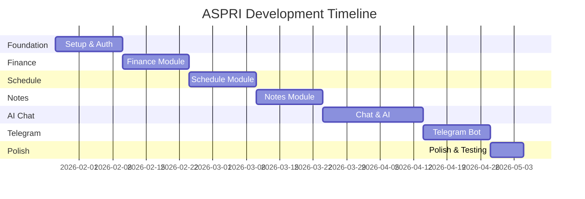

# ASPRI Development Plan

## Implementation Plan Overview

Refactor ASPRI dari arsitektur lama (Python/React dan rencana Java/Angular) ke Laravel 12 + Vue 3 + Inertia v2.

## Development Phases

### Phase 1: Foundation (Week 1-2)

**Objective**: Setup project foundation dan authentication

| Task | Priority | Estimate |
|------|----------|----------|
| Setup Laravel Breeze dengan Vue/Inertia | High | 2 jam |
| Setup database migrations | High | 4 jam |
| Create User model dengan profile fields | High | 2 jam |
| Setup UI layout (sidebar, navbar) | High | 4 jam |
| Create Dashboard page (static) | High | 4 jam |
| Setup Tailwind theme (colors, dark mode) | Medium | 3 jam |

**Deliverables**:
- ✅ Working authentication (register/login/logout)
- ✅ Dashboard layout matching mockup
- ✅ Database schema untuk profiles

---

### Phase 1.5: Admin Module (Week 2-3)

**Objective**: Setup admin panel untuk system configuration

| Task | Priority | Estimate |
|------|----------|----------|
| Add role field to users | High | 1 jam |
| Create system_settings migration | High | 1 jam |
| Create admin middleware | High | 2 jam |
| Create Admin Dashboard page | High | 4 jam |
| Create User Management pages | High | 6 jam |
| Create AI Provider settings page | High | 4 jam |
| Create System Settings page | Medium | 3 jam |
| Create SettingsService | High | 3 jam |

**Deliverables**:
- ✅ Admin dashboard with user stats
- ✅ AI provider configuration (Gemini default)
- ✅ User management CRUD

---

### Phase 2: Finance Module (Week 3-4)

**Objective**: Implement finance tracking feature

| Task | Priority | Estimate |
|------|----------|----------|
| Create Finance migrations | High | 2 jam |
| Create Finance models (Account, Category, Transaction) | High | 2 jam |
| Create FinanceController | High | 4 jam |
| Create Finance pages (list, create, edit) | High | 8 jam |
| Implement transaction CRUD | High | 4 jam |
| Create category management | Medium | 3 jam |
| Create account management | Medium | 3 jam |
| Add charts (weekly/monthly) | Medium | 4 jam |
| Dashboard finance widgets | Medium | 3 jam |

**Deliverables**:
- ✅ Full finance CRUD
- ✅ Category and account management
- ✅ Dashboard widgets showing monthly total

---

### Phase 3: Schedule Module (Week 5-6)

**Objective**: Implement calendar dan event management

| Task | Priority | Estimate |
|------|----------|----------|
| Create Schedule migrations | High | 2 jam |
| Create Calendar, Event, Reminder models | High | 2 jam |
| Create ScheduleController | High | 4 jam |
| Create Calendar view page | High | 8 jam |
| Implement event CRUD | High | 4 jam |
| Create reminder system | Medium | 4 jam |
| Add recurring events (RRULE) | Low | 6 jam |
| Dashboard schedule widgets | Medium | 3 jam |

**Deliverables**:
- ✅ Calendar view dengan events
- ✅ Event CRUD functionality
- ✅ Reminder system (in-app)

---

### Phase 4: Notes Module (Week 7-8)

**Objective**: Implement notes dengan block-based content

| Task | Priority | Estimate |
|------|----------|----------|
| Create Notes migrations | High | 2 jam |
| Create Note, NoteBlock models | High | 2 jam |
| Create NoteController | High | 4 jam |
| Create Notes list page | High | 4 jam |
| Create Note editor (block-based) | High | 12 jam |
| Implement tags system | Medium | 4 jam |
| Add search functionality | Medium | 4 jam |
| Implement backlinks | Low | 6 jam |

**Deliverables**:
- ✅ Notes CRUD
- ✅ Block-based editor
- ✅ Tags and search

---

### Phase 5: Chat & AI Integration (Week 9-11)

**Objective**: Implement chat interface dan AI integration

| Task | Priority | Estimate |
|------|----------|----------|
| Create Chat migrations | High | 2 jam |
| Create ChatThread, ChatMessage models | High | 2 jam |
| Create ChatController | High | 4 jam |
| Create Chat UI | High | 8 jam |
| Setup AI service abstraction | High | 4 jam |
| Implement intent parsing | High | 8 jam |
| Create action execution system | High | 8 jam |
| Implement confirmation flow | High | 4 jam |
| Create user persona system | Medium | 3 jam |

**Deliverables**:
- ✅ Web chat interface
- ✅ AI-powered responses
- ✅ Natural language command processing

---

### Phase 6: Telegram Integration (Week 12-13)

**Objective**: Integrate Telegram bot

| Task | Priority | Estimate |
|------|----------|----------|
| Setup Telegram bot | High | 2 jam |
| Create webhook endpoint | High | 4 jam |
| Implement Telegram linking flow | High | 4 jam |
| Process messages from Telegram | High | 6 jam |
| Send responses to Telegram | High | 4 jam |
| Implement reminder notifications | Medium | 4 jam |
| Test full flow | High | 4 jam |

**Deliverables**:
- ✅ Working Telegram bot
- ✅ Account linking
- ✅ Full chat capabilities via Telegram

---

### Phase 7: Polish & Optimization (Week 14)

**Objective**: Final polish dan optimization

| Task | Priority | Estimate |
|------|----------|----------|
| UI/UX review dan improvements | High | 8 jam |
| Performance optimization | Medium | 4 jam |
| Security audit | High | 4 jam |
| Documentation update | Medium | 4 jam |
| Testing & bug fixes | High | 8 jam |

**Deliverables**:
- ✅ Production-ready application
- ✅ Complete documentation
- ✅ All tests passing

---

## Timeline Summary

## Technical Decisions

### Why Laravel 12 + Vue 3?
1. **Productivity**: Laravel ecosystem dengan built-in auth, ORM, queue
2. **Inertia.js**: SPA experience tanpa API boilerplate
3. **Type Safety**: TypeScript + Wayfinder untuk type-safe routes
4. **Modern Stack**: Vue 3 Composition API, Tailwind CSS 4

### Database Choice
- **PostgreSQL**: Untuk development dan production
- Konsisten environment antara dev dan prod

### AI Provider Strategy
- Abstract AI provider behind interface
- **Default: Google Gemini** (configurable via Admin)
- Support OpenAI dan Anthropic Claude
- Settings stored in database, manageable via Admin UI

### Telegram Integration
- Webhook-based (production ready)
- Long polling option untuk development
- Queue-based message processing

## Success Metrics

- [ ] User dapat register dan login
- [ ] Dashboard menampilkan summary keuangan dan jadwal
- [ ] User dapat mencatat transaksi via web dan chat
- [ ] User dapat membuat event dan menerima reminder
- [ ] User dapat menulis dan mencari notes
- [ ] Telegram bot berfungsi penuh
- [ ] Response time chat < 3 detik
