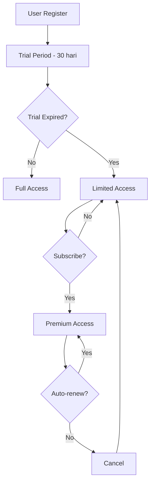

# ASPRI Subscription & Billing

## Overview

ASPRI menggunakan model freemium dengan trial period dan subscription premium.

## Subscription Tiers

| Tier | Duration | Price | Features |
|------|----------|-------|----------|
| **Trial** | 30 hari | Gratis | Semua fitur premium |
| **Premium Monthly** | 1 bulan | Rp 10.000 | Semua fitur |
| **Premium Yearly** | 1 tahun | Rp 100.000 | Semua fitur + hemat 17% |

## Feature Comparison

| Feature | Trial (30 hari) | Premium |
|---------|-----------------|---------|
| Dashboard | ✅ | ✅ |
| Finance tracking | ✅ | ✅ |
| Schedule/Calendar | ✅ | ✅ |
| Notes | ✅ | ✅ |
| AI Chat | ✅ | ✅ |
| Telegram integration | ✅ | ✅ |
| Support | Community | Priority |

## User Journey



## Database Schema

### subscriptions
Track user subscription status.

```php
Schema::create('subscriptions', function (Blueprint $table) {
    $table->uuid('id')->primary();
    $table->foreignId('user_id')->constrained()->cascadeOnDelete();
    $table->string('plan'); // trial, monthly, yearly
    $table->string('status'); // active, expired, cancelled
    $table->decimal('price', 10, 2)->default(0);
    $table->timestamp('starts_at');
    $table->timestamp('ends_at');
    $table->timestamp('cancelled_at')->nullable();
    $table->timestamps();
    
    $table->index(['user_id', 'status']);
});
```

### subscription_plans
Available subscription plans.

```php
Schema::create('subscription_plans', function (Blueprint $table) {
    $table->id();
    $table->string('slug')->unique(); // trial, monthly, yearly
    $table->string('name');
    $table->text('description')->nullable();
    $table->decimal('price', 10, 2);
    $table->integer('duration_days');
    $table->boolean('is_active')->default(true);
    $table->json('features')->nullable();
    $table->timestamps();
});
```

### payments
Payment history.

```php
Schema::create('payments', function (Blueprint $table) {
    $table->uuid('id')->primary();
    $table->foreignId('user_id')->constrained()->cascadeOnDelete();
    $table->uuid('subscription_id');
    $table->decimal('amount', 10, 2);
    $table->string('payment_method')->nullable(); // bank_transfer, e-wallet
    $table->string('status'); // pending, completed, failed, refunded
    $table->string('external_id')->nullable(); // payment gateway reference
    $table->json('metadata')->nullable();
    $table->timestamp('paid_at')->nullable();
    $table->timestamps();
    
    $table->foreign('subscription_id')
        ->references('id')
        ->on('subscriptions')
        ->cascadeOnDelete();
});
```

## Default Plans Seeder

```php
class SubscriptionPlansSeeder extends Seeder
{
    public function run(): void
    {
        $plans = [
            [
                'slug' => 'trial',
                'name' => 'Trial',
                'description' => 'Coba semua fitur gratis selama 30 hari',
                'price' => 0,
                'duration_days' => 30,
            ],
            [
                'slug' => 'monthly',
                'name' => 'Premium Bulanan',
                'description' => 'Akses penuh semua fitur',
                'price' => 10000,
                'duration_days' => 30,
            ],
            [
                'slug' => 'yearly',
                'name' => 'Premium Tahunan',
                'description' => 'Hemat 17% dengan langganan tahunan',
                'price' => 100000,
                'duration_days' => 365,
            ],
        ];
        
        foreach ($plans as $plan) {
            SubscriptionPlan::updateOrCreate(
                ['slug' => $plan['slug']],
                $plan
            );
        }
    }
}
```

## Subscription Service

```php
namespace App\Services;

class SubscriptionService
{
    public function createTrialSubscription(User $user): Subscription
    {
        return Subscription::create([
            'user_id' => $user->id,
            'plan' => 'trial',
            'status' => 'active',
            'price' => 0,
            'starts_at' => now(),
            'ends_at' => now()->addDays(30),
        ]);
    }
    
    public function subscribe(User $user, string $plan): Subscription
    {
        $planData = SubscriptionPlan::where('slug', $plan)->firstOrFail();
        
        // Cancel existing subscription
        $this->cancelActiveSubscription($user);
        
        return Subscription::create([
            'user_id' => $user->id,
            'plan' => $plan,
            'status' => 'active',
            'price' => $planData->price,
            'starts_at' => now(),
            'ends_at' => now()->addDays($planData->duration_days),
        ]);
    }
    
    public function hasActiveSubscription(User $user): bool
    {
        return $user->subscriptions()
            ->where('status', 'active')
            ->where('ends_at', '>', now())
            ->exists();
    }
    
    public function isTrialActive(User $user): bool
    {
        return $user->subscriptions()
            ->where('plan', 'trial')
            ->where('status', 'active')
            ->where('ends_at', '>', now())
            ->exists();
    }
    
    public function getDaysRemaining(User $user): int
    {
        $subscription = $user->subscriptions()
            ->where('status', 'active')
            ->where('ends_at', '>', now())
            ->first();
            
        return $subscription 
            ? now()->diffInDays($subscription->ends_at) 
            : 0;
    }
}
```

## Middleware

```php
// app/Http/Middleware/SubscriptionMiddleware.php
class SubscriptionMiddleware
{
    public function __construct(
        private SubscriptionService $subscriptionService
    ) {}
    
    public function handle(Request $request, Closure $next)
    {
        $user = $request->user();
        
        if (!$this->subscriptionService->hasActiveSubscription($user)) {
            // Redirect to subscription page
            return redirect()->route('subscription.index')
                ->with('warning', 'Masa trial Anda telah berakhir. Silakan berlangganan untuk melanjutkan.');
        }
        
        return $next($request);
    }
}
```

## Registration Flow

```php
// In RegisteredUserController or RegisterController
public function store(Request $request)
{
    // ... validation and user creation
    
    // Create trial subscription
    app(SubscriptionService::class)->createTrialSubscription($user);
    
    // ... login and redirect
}
```

## Admin Features

Di admin panel, tambahkan:
- View all subscriptions
- Subscription analytics (trial conversions, revenue)
- Manual subscription management
- Promo code management (future)

## Payment Integration (Future)

Untuk MVP, pembayaran bisa dilakukan manual (transfer bank).
Future integration options:
- Midtrans
- Xendit
- DOKU

## API Endpoints

### Subscription
- `GET /subscription` - View current subscription
- `POST /subscription/subscribe` - Subscribe to a plan
- `POST /subscription/cancel` - Cancel subscription

### Admin
- `GET /admin/subscriptions` - List all subscriptions
- `GET /admin/subscriptions/analytics` - Subscription analytics
