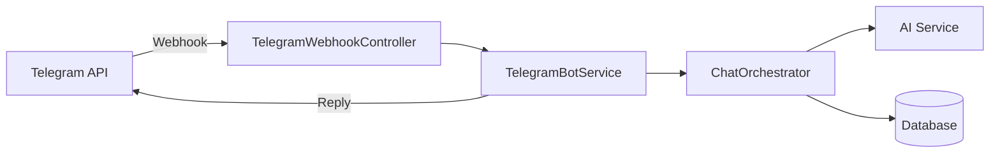

# ASPRI Telegram Integration

## Overview

Integrasi Telegram memungkinkan user berinteraksi dengan ASPRI melalui bot Telegram.

## Architecture



## Setup

### 1. Create Telegram Bot

1. Chat dengan [@BotFather](https://t.me/BotFather)
2. Kirim `/newbot`
3. Ikuti instruksi untuk set nama dan username
4. Simpan token yang diberikan

### 2. Configure Bot Token

Ada dua cara untuk mengkonfigurasi bot token:

#### Option A: Via Admin Panel (Recommended)

1. Login sebagai super admin
2. Buka **Admin > Settings > Telegram**
3. Masukkan bot token dan webhook URL
4. Klik Save

Bot token akan disimpan terenkripsi di database dan diambil secara otomatis oleh sistem.

#### Option B: Via Environment Variable

Tambahkan ke file `.env`:

```env
TELEGRAM_BOT_TOKEN=123456789:ABCdefGHIjklMNOpqrsTUVwxyz
TELEGRAM_BOT_USERNAME=aspri_assistant_bot
TELEGRAM_WEBHOOK_SECRET=random-secret-string
```

**Note:** Token dari database (Admin Panel) memiliki prioritas lebih tinggi daripada environment variable. Jika token tidak ada di database, sistem akan fallback ke environment variable.

### 3. Set Webhook

```bash
# Set webhook URL
curl -X POST "https://api.telegram.org/bot{TOKEN}/setWebhook" \
  -H "Content-Type: application/json" \
  -d '{
    "url": "https://yourapp.com/api/telegram/webhook",
    "secret_token": "random-secret-string"
  }'
```

## Implementation

### Webhook Controller

```php
<?php

namespace App\Http\Controllers\Api;

use App\Services\Telegram\TelegramBotService;
use Illuminate\Http\Request;

class TelegramWebhookController extends Controller
{
    public function __construct(
        private TelegramBotService $telegramService,
    ) {}
    
    public function __invoke(Request $request)
    {
        // Verify secret token
        $secret = $request->header('X-Telegram-Bot-Api-Secret-Token');
        if ($secret !== config('services.telegram.webhook_secret')) {
            abort(401);
        }
        
        $update = $request->all();
        
        // Process in background for faster response
        dispatch(new ProcessTelegramUpdate($update));
        
        return response('OK', 200);
    }
}
```

### Telegram Bot Service

```php
<?php

namespace App\Services\Telegram;

use App\Models\ExternalIdentity;
use App\Services\Admin\SettingsService;
use App\Services\Chat\ChatOrchestrator;
use Illuminate\Support\Facades\Http;
use Illuminate\Support\Facades\Schema;

class TelegramBotService
{
    private string $baseUrl;
    
    public function __construct(
        private ChatOrchestrator $chatOrchestrator,
        private SettingsService $settingsService,
    ) {
        // Get bot token from database first, then fallback to config/env
        $botToken = null;
        if (Schema::hasTable('system_settings')) {
            $botToken = $this->settingsService->get('telegram_bot_token');
        }
        
        if (!$botToken) {
            $botToken = config('services.telegram.bot_token') ?? env('TELEGRAM_BOT_TOKEN');
        }
        
        $this->baseUrl = "https://api.telegram.org/bot{$botToken}";
    }
    
    public function handleUpdate(array $update): void
    {
        $message = $update['message'] ?? null;
        if (!$message) {
            return;
        }
        
        $chatId = $message['chat']['id'];
        $text = $message['text'] ?? '';
        $from = $message['from'];
        
        // Handle /start command
        if (str_starts_with($text, '/start')) {
            $this->handleStart($chatId, $from);
            return;
        }
        
        // Handle /link command
        if (str_starts_with($text, '/link ')) {
            $code = trim(substr($text, 6));
            $this->handleLink($chatId, $from, $code);
            return;
        }
        
        // Process regular message
        $this->processMessage($chatId, $from, $text);
    }
    
    private function handleStart(int $chatId, array $from): void
    {
        $name = $from['first_name'] ?? 'there';
        
        $this->sendMessage($chatId, 
            "Halo {$name}! 👋\n\n" .
            "Saya ASPRI, asisten pribadi Anda.\n\n" .
            "Untuk mulai, hubungkan akun Telegram Anda:\n" .
            "1. Login ke web app\n" .
            "2. Klik 'Link Telegram'\n" .
            "3. Kirim kode ke sini dengan: /link <KODE>"
        );
    }
    
    private function handleLink(int $chatId, array $from, string $code): void
    {
        $result = $this->linkAccount($chatId, $from, $code);
        
        if ($result['success']) {
            $this->sendMessage($chatId,
                "✅ Akun berhasil dihubungkan!\n\n" .
                "Sekarang Anda bisa chat dengan saya langsung di sini."
            );
        } else {
            $this->sendMessage($chatId,
                "❌ Kode tidak valid atau sudah kadaluarsa.\n\n" .
                "Silakan generate kode baru di web app."
            );
        }
    }
    
    private function processMessage(int $chatId, array $from, string $text): void
    {
        // Find linked user
        $identity = ExternalIdentity::where('provider', 'telegram')
            ->where('provider_chat_id', $chatId)
            ->first();
            
        if (!$identity) {
            $this->sendMessage($chatId,
                "Akun Telegram Anda belum terhubung.\n" .
                "Gunakan /link <KODE> untuk menghubungkan."
            );
            return;
        }
        
        // Process with ChatOrchestrator
        $response = $this->chatOrchestrator->process(
            userId: $identity->user_id,
            message: $text,
            channel: 'telegram',
            externalMessageId: (string) $from['id'],
        );
        
        $this->sendMessage($chatId, $response);
    }
    
    public function sendMessage(int $chatId, string $text): void
    {
        Http::post("{$this->baseUrl}/sendMessage", [
            'chat_id' => $chatId,
            'text' => $text,
            'parse_mode' => 'HTML',
        ]);
    }
}
```

## Account Linking Flow

### 1. Generate Link Code (Web)

```php
// ProfileController.php
public function generateTelegramLinkCode(Request $request)
{
    $code = strtoupper(Str::random(6));
    
    IntegrationLinkCode::create([
        'user_id' => auth()->id(),
        'provider' => 'telegram',
        'code' => $code,
        'expires_at' => now()->addMinutes(5),
    ]);
    
    return response()->json([
        'code' => $code,
        'expires_in' => 300,
    ]);
}
```

### 2. User Sends Code to Bot

User kirim: `/link ABC123`

### 3. Validate and Link

```php
// TelegramBotService.php
private function linkAccount(int $chatId, array $from, string $code): array
{
    $linkCode = IntegrationLinkCode::where('provider', 'telegram')
        ->where('code', strtoupper($code))
        ->where('expires_at', '>', now())
        ->whereNull('used_at')
        ->first();
        
    if (!$linkCode) {
        return ['success' => false];
    }
    
    // Create external identity
    ExternalIdentity::updateOrCreate(
        [
            'provider' => 'telegram',
            'provider_user_id' => (string) $from['id'],
        ],
        [
            'user_id' => $linkCode->user_id,
            'provider_chat_id' => (string) $chatId,
            'provider_username' => $from['username'] ?? null,
        ]
    );
    
    // Mark code as used
    $linkCode->update(['used_at' => now()]);
    
    return ['success' => true];
}
```

## Bot Commands

| Command | Description |
|---------|-------------|
| `/start` | Welcome message |
| `/link <CODE>` | Link Telegram account |
| `/help` | Show available commands |
| `/unlink` | Unlink Telegram account |

## Security Considerations

1. **Webhook Secret**: Always verify `X-Telegram-Bot-Api-Secret-Token`
2. **Rate Limiting**: Implement per-chat rate limiting
3. **Link Code TTL**: Codes expire after 5 minutes
4. **One-time Use**: Link codes can only be used once

## Testing

### Local Development

Gunakan ngrok untuk expose local server:

```bash
ngrok http 8000
```

Set webhook ke URL ngrok:

```bash
curl -X POST "https://api.telegram.org/bot{TOKEN}/setWebhook" \
  -d "url=https://abc123.ngrok.io/api/telegram/webhook"
```

### Test Commands

```bash
# Get webhook info
curl "https://api.telegram.org/bot{TOKEN}/getWebhookInfo"

# Delete webhook (switch to polling)
curl "https://api.telegram.org/bot{TOKEN}/deleteWebhook"

# Get updates (polling mode)
curl "https://api.telegram.org/bot{TOKEN}/getUpdates"
```
